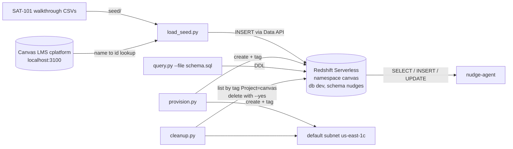
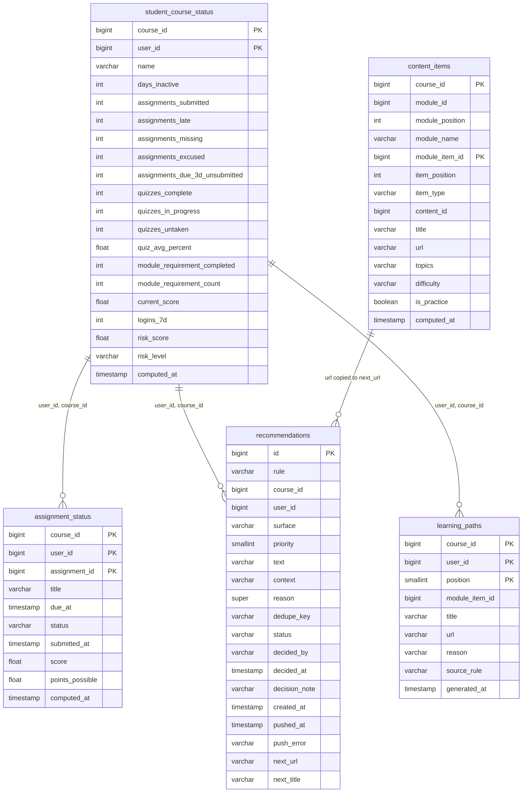
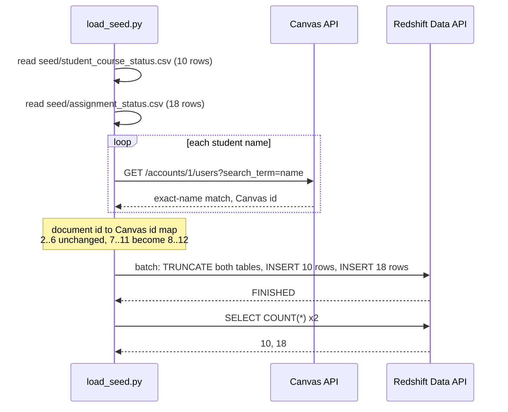
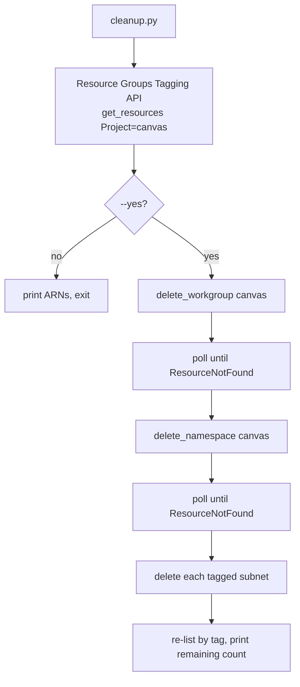

# Redshift POC: Architecture and Design

Status: implemented and verified on 15 September 2026. Companion to the agent that consumes
this data, documented in the `nudge-agent` repository under `docs/ARCHITECTURE.md`.

## 1. Purpose

This project stands up the smallest Amazon Redshift deployment that can hold the SAT-101
student status dataset and serve it to a scheduled nudge agent. It exists to prove the pipeline
shape, not to carry production load. Every design choice below favours zero idle cost, rerunnable
scripts, and a teardown that leaves nothing behind.

The dataset comes from the "SAT-101 Nudge Walkthrough" document, section "The dataset as CSV".
Ten students and eighteen assignment rows describe Day 0, Tuesday 15 September 2026.

## 2. System context

Two external systems touch this project. Canvas is read once during seed loading to resolve
student names to Canvas user ids. The nudge agent reads the two status tables and owns the
third table, `recommendations`, which this project only creates.

## 3. Infrastructure

### 3.1 Resources

| Resource | Name | Settings | Tags |
|---|---|---|---|
| Redshift Serverless namespace | `canvas` | database `dev`, admin user `canvasadmin`, password managed by Redshift | Project=canvas, Environment=poc |
| Redshift Serverless workgroup | `canvas` | base 4 RPU, max 8 RPU, not publicly accessible, default VPC subnets in us-east-1a, 1b, 1c | Project=canvas, Environment=poc |
| EC2 default subnet | `canvas-redshift` | us-east-1c, created because the default VPC had only two AZs and a workgroup needs three | Project=canvas, Environment=poc, Name=canvas-redshift |

Region is us-east-1. Account and IAM identity come from the caller's AWS CLI profile.

### 3.2 Why Serverless at 4 RPU

| Option | Idle cost | Cost per scan | Teardown |
|---|---|---|---|
| Serverless, 4 RPU | none for compute, cents for storage | 60 second minimum per burst, about $0.03 | two delete calls |
| Provisioned dc2.large | about $180 a month unless paused by hand | included | delete cluster, remember to skip the final snapshot |

The agent runs two short bursts a day. Serverless bills per second with a 60 second minimum, so
the monthly compute cost is a few dollars. A provisioned cluster would cost more idle in one day
than Serverless costs in a month. The provisioning script tries 4 RPU first and falls back to 8
if the region rejects the smaller size, which keeps the script portable across regions.

### 3.3 Access model

All SQL goes through the Redshift Data API under the caller's IAM identity. The consequences:

- No database password is stored, passed, or rotated. Redshift keeps the admin secret in
  Secrets Manager and deletes it with the namespace.
- No network path into the VPC is needed. The workgroup is not publicly accessible and no
  security group rule was opened. HTTPS to the Data API endpoint is the only path.
- Every statement is attributed to the IAM user in Redshift's audit tables as `IAM:<user>`.
- Latency is higher than a JDBC connection, about two seconds per statement because the
  client polls `describe_statement` once a second. That is acceptable for a batch agent.

### 3.4 Tagging as the cleanup contract

`Project=canvas` is the key that `cleanup.py` lists and deletes by. The provisioning script
writes it on every resource it creates, including the subnet. Anything added to this POC later
must carry the same tag or cleanup will walk past it. The namespace and workgroup names are also
`canvas`, so a reader of the AWS console and a reader of the tagging API reach the same answer.

## 4. Data model

Schema `nudges` holds five tables. The first two are inputs the agent reads. The third is the
agent's queue and audit trail, created here so the agent has no DDL of its own. The fourth is a
small dimension that tags the course's module items. The fifth is the ordered path the agent
computes for each student and the LTI dashboard renders.

The last line is a copy, not a key. The resolver reads `content_items.url` and writes the string
into `recommendations.next_url`, so nothing joins the two tables back together by id.

### 4.1 Design notes

- **Column names come from the earlier streaming plan.** The cplatform repository's
  `nudges/streaming-to-redshift.md` already defined `student_course_status` and
  `assignment_status`. This project reuses those names and adds the columns the walkthrough CSV
  carries, so a later real feed can populate the same tables without a migration.
- **Columns the CSV does not fill stay NULL.** `enrollment_id`, `last_activity_at`,
  `assignments_total`, `quizzes_total` and similar exist for the future feed. `quiz_avg_percent`
  is NULL for the four students who have taken no quiz, and the agent treats NULL as "no
  average" rather than zero.
- **Distribution and sort keys.** All three tables use `DISTKEY (user_id)` so a per-student
  join stays on one slice. Sort keys follow the dominant read: the agent reads a course at a
  time, so `course_id` leads; `recommendations` is read in creation order, so `created_at` leads.
- **`reason` is SUPER.** Each rule records the facts it fired on as a JSON document. SUPER
  keeps that queryable without a column per rule.
- **`recommendations.status` is a state machine.** The allowed values and transitions are
  owned by the agent (`proposed`, `approved`, `rejected`, `pushed`, `push_failed`). The table
  stores the state and the decision metadata; it does not enforce transitions. The agent does,
  in the `WHERE` clause of every status update.
- **`dedupe_key`** is `rule|course_id|user_id|subject|date`. It has no unique constraint
  because Redshift does not enforce them; the agent checks for existing keys before inserting.
- **`IDENTITY(1,1)`** on `recommendations.id` gives the approval page a stable handle per row.

### 4.2 Item tagging table

Canvas has no item-level topic tagging. The modules API returns a title, a type and an
`html_url` for each item and says nothing about what the item teaches. `content_items` is the
external bridge that supplies the missing facts. It maps every module item of the course to its
SAT topics, a difficulty band, and a practice flag.

`load_content_items.py` builds it from the live course, joining each module item to the
hand-written `seed/content_tags.csv` on exact title. The CSV is the only place a human edits.
An item with no tag row still loads, with NULL topics and `is_practice` false, and the loader
prints a warning so the gap is visible.

The nudge agent's next-step resolver reads this table. It picks the practice item whose topics
match the student's weak area and writes that item's title and url onto the recommendation. The
CSV therefore decides what "do this next" means for every rule.

`topics` is a comma-separated list in a plain VARCHAR. A SUPER array would need `JSON_PARSE` on
write and unnest syntax on read, which nothing else in this schema uses, and a `LIKE '%Reading%'`
answers the resolver's question today. `DISTSTYLE ALL` puts the whole table on every slice
because it is small and every rule joins it.

### 4.3 Learning paths

`learning_paths` is what one student should do next, in order, one row per step. The agent computes
that order and stores the result, so the table holds no rule. Anything missing comes first, then
anything due soon, then a quiz left in progress, then a practice item for the topic the student is
weakest in. Only after those does the course's own module order fill the rest. The list stops at
eight steps. A list longer than that is a backlog, not a next action.

Each row carries the module item it points at, the title and url the dashboard renders, a short
`reason` for the student, and the `source_rule` that placed the step. The `source_rule` is what lets
you trace a surprising path back to the rule that built it. The LTI dashboard reads the rows for the
signed-in student in `position` order and renders what it finds.

The remediation module is why the path cannot be course order alone. "Remediation: Heart of Algebra"
is hidden from the course by default and becomes visible to one student only when a Canvas module
override names them. The agent reads those overrides from Canvas each time it generates a path, so
the module's items reach a path only for the students who can open them. The override stays in
Canvas and is never copied into Redshift. This table holds no visibility rule of its own, which
means no stale copy of one can put a hidden item on a student's screen.

## 5. Seed loading

### 5.1 The id mapping problem

The walkthrough document numbers its students 2 to 11. The live Canvas instance already had
students 2 to 6 and a control student, Grace Kim, at id 7. The five remaining document students
were created in Canvas and received ids 8 to 12. If the loader wrote document ids, every nudge
for users 7 to 11 would reach the wrong person.

The loader resolves each CSV name against the Canvas account and writes the Canvas id. It exits
with the list of unmatched names rather than loading a partial table. The `--doc-ids` flag skips
the lookup for offline use, for example when running the agent's golden test against the CSVs
directly.

Final map on this instance:

| Document id | Canvas id | Student |
|---|---|---|
| 2 to 6 | 2 to 6 | Ava Patel, Ben Okafor, Chloe Nguyen, Dev Sharma, Elena Rossi |
| 7 | 8 | Farah Haddad |
| 8 | 9 | Gabriel Silva |
| 9 | 10 | Hana Sato |
| 10 | 11 | Ibrahim Khan |
| 11 | 12 | Julia Costa |

### 5.2 Why multi-row INSERT and not COPY

Twenty-eight rows fit in one `INSERT ... VALUES` statement per table. COPY would need an S3
bucket, an IAM role for Redshift to assume, and a cleanup entry for each. None of that earns its
place at this size. If the seed grows past a few thousand rows, switch to COPY from S3 and tag
the bucket `Project=canvas`.

## 6. Scripts

Every script is a flat PEP 723 file run with `uv run`, so the only prerequisite is `uv` and an
AWS CLI profile.

| Script | Role | Idempotent because |
|---|---|---|
| `provision.py` | create subnet, namespace, workgroup; wait for AVAILABLE; print ARNs | each resource is looked up by name before creation |
| `data_api.py` | shared `run` and `run_many` over the Data API; not run directly | n/a |
| `schema.sql` | DDL for the schema and five tables | every statement is `IF NOT EXISTS` |
| `query.py` | `--sql` prints a result table, `--file` applies a script | n/a |
| `load_seed.py` | CSVs to tables with the id map | truncates before inserting |
| `migrations/*.sql` | ALTER statements that `schema.sql` cannot express | every statement is guarded by `migrate.py` |
| `migrate.py` | apply each migration file in name order | checks `information_schema.columns` before each ADD COLUMN |
| `load_content_items.py` | Canvas module items plus the tag CSV to `content_items` | deletes the course's rows before inserting |
| `cleanup.py` | list tagged ARNs; delete with `--yes` | deletes tolerate already-gone resources |

`data_api.py` is the single Redshift primitive. `run` returns rows as dicts with the Data API's
typed cells flattened to Python values. `run_many` submits a batch and waits, used for DDL and
for the truncate-then-insert load so the two run as one unit.

## 7. Cleanup

Order matters: a namespace cannot be deleted while a workgroup references it, so the workgroup
goes first and the script polls until it is gone. Only subnets that carry the tag are deleted,
which protects the two pre-existing default subnets. The final re-list is the proof that nothing
remains; a non-zero count means something was created outside the script without the tag.

The scheduled tasks and the Canvas seed users live outside AWS and are removed separately.

## 8. Verification record

Run on 15 September 2026, in order. Each unit was green before the next started.

| Unit | Check | Result |
|---|---|---|
| provision | first run | subnet, namespace, workgroup created, 4 RPU accepted |
| provision | second run | every step reported "exists", nothing changed |
| tags | tagging API | exactly 3 ARNs |
| access | `SELECT 1, current_user` | `1`, `IAM:rdp` |
| schema | apply twice | 4 statements each time, 3 tables present |
| load | run twice | counts 10 and 18 both times |
| cleanup | dry run | 3 ARNs listed, nothing deleted |
| content items | schema twice, migrate twice, load twice | 5 statements and 4 tables each time, 2 columns added then both "already present", 12 rows both loads |
| learning paths | schema twice, load content items twice | 6 statements and 5 tables each time, `learning_paths` created with 9 columns and 0 rows, content_items 14 rows both loads |

## 9. Limits and future work

- **No unique constraint on `dedupe_key`.** Redshift accepts the constraint syntax but does not
  enforce it. Deduplication is the agent's responsibility.
- **Single region, default VPC.** Fine for a POC. A hosted version should use a dedicated VPC
  and pass its subnet ids to the provisioning script.
- **Seed is static.** The tables describe one day. The streaming plan in the cplatform repository
  describes how Canvas Live Events would keep them current; this project's schema is compatible
  with that plan.
- **Data API latency.** About two seconds per statement. If the approval page or the agent
  becomes interactive at scale, a direct connection through a bastion would be faster.
